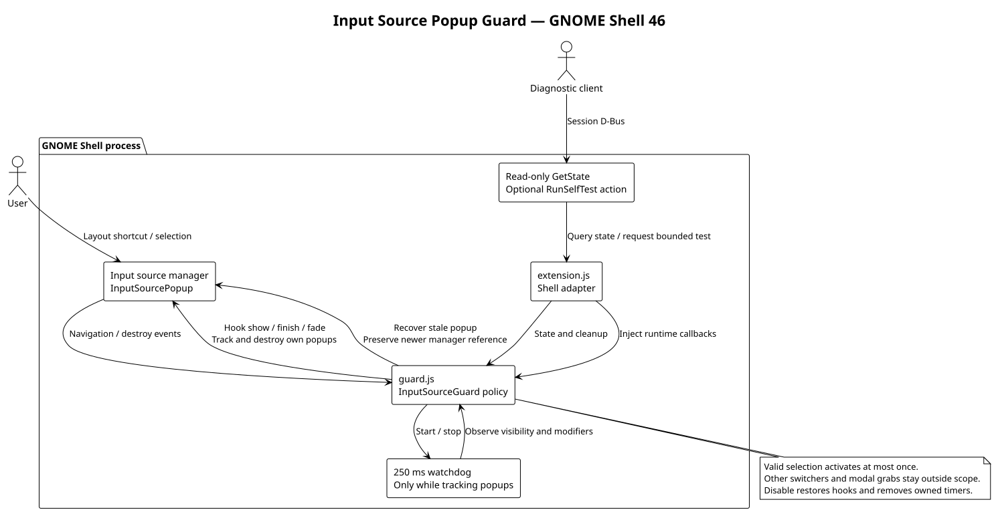

# Input Source Popup Guard v2

A small **GNOME Shell 46** extension that prevents the keyboard-layout switcher
from keeping its input grab after it should have closed. Keep using your normal
layout-switching shortcut; there is no separate application or settings panel.


Read-only diagnostics from GNOME Shell 46; see the [visual guide](docs/visual-guide.md)
for capture details.

## What it does

The extension changes only GNOME's `InputSourcePopup` lifecycle. A valid selection
activates once, then the popup is destroyed immediately, including when activation
throws. Opening another layout popup cleans up an older one without losing the
input-source manager's newer reference.

| Situation | Recovery behavior |
| --- | --- |
| Modifier released | A 250 ms watchdog confirms release for at least 500 ms, then finishes the popup. |
| Popup without a modifier mask | Finishes after 2 seconds without navigation activity; native GNOME completion still applies. |
| Hidden, unmapped, or transparent popup | Destroys it after more than 1 second in that state. |
| Visible popup with its modifier held | No age limit; normal selection can continue. |
| Extension disabled | Destroys tracked popups, removes timers/connections, and restores its prototype hooks. |

The watchdog runs only while popups are tracked. Other switchers and their modal
grabs remain outside this extension's scope. This is a targeted popup recovery
mechanism, not a general keyboard or desktop performance fix.

## Install and use

Requirements: GNOME Shell **46**, GNU Make, and Node.js with the built-in test
runner (Node 20 is used in CI). There are no npm dependencies.

```sh
make check test
make install
```

Installation copies the extension into your user extension directory; it does
not enable it. Disable any older input-source guard first using GNOME Extensions.
After GNOME discovers the new extension, enable it:

```sh
gnome-extensions enable input-source-popup-guard-v2@sagecat.local
```

On Wayland, new extension discovery or replacing imported modules can require a
normal logout and login. Save your work first; installing new files does not
reload the running module. A coordinated workspace-state installation should use
its release staging and next-login activation instead of replacing files live.

Switch layouts with your configured shortcut and release the modifier normally.
To stop using the guard:

```sh
gnome-extensions disable input-source-popup-guard-v2@sagecat.local
```

## Diagnose

This call is read-only and does not evaluate JavaScript or synthesize key events:

```sh
gdbus call --session --dest org.gnome.Shell \
  --object-path /org/sagecat/InputSourceGuard \
  --method org.sagecat.InputSourceGuard.GetState
```

The response is a D-Bus string containing JSON. Useful fields:

| Field | Meaning |
| --- | --- |
| `enabled` | Whether the guard policy is active. |
| `modalCount`, `modalActors` | Shell modal state; another application's modal is not necessarily a guard fault. |
| `popups`, `tracked` | Current popup state and tracked ages; usually empty when the layout switcher is closed. |
| `recoveryCounts`, `lastRecovery` | Recovery reasons and the most recent before/after evidence. |
| `currentLayout` | Current input-source identity. |
| `build` | Loaded extension UUID, metadata version, revision, and whether exact source identity is known. |

The top-level `version: 2` identifies the guard policy, not the metadata package
version. `build.revision: "development"` means unstamped source; it does not prove
which checkout is running.

`RunSelfTest` is an **optional action**, not a read-only query. It briefly creates
real popups with dummy items, verifies finish and stacking behavior, then destroys
them. It sends no synthetic keys and does not change layouts. It refuses locked
sessions, existing modal actors, or existing input popups:

```sh
gdbus call --session --dest org.gnome.Shell \
  --object-path /org/sagecat/InputSourceGuard \
  --method org.sagecat.InputSourceGuard.RunSelfTest
```

## Troubleshooting and limits

- **D-Bus object unavailable:** check `gnome-extensions info input-source-popup-guard-v2@sagecat.local`.
  The diagnostics object exists only while the extension is enabled successfully.
- **New files, old revision:** inspect `build`, then use a normal next login to load
  the staged revision. A file timestamp is not proof of running code identity.
- **Extension fails to enable:** confirm GNOME 46 and that an older guard is disabled.
  Review `journalctl --user -b` locally for `[InputSourceGuard v2]` messages.
- **Keyboard remains stuck with no tracked popup:** the problem may involve a
  different input owner. Capture diagnostics rather than repeatedly toggling extensions.

Review diagnostics before sharing: layout identifiers and recovery snapshots can
reveal your local configuration. This extension uses private GNOME 46 APIs; other
Shell versions are deliberately unsupported.

## Design



The [PlantUML source](docs/architecture.puml) separates the Shell adapter from the
policy and its injected runtime. Re-render it with:

```sh
plantuml -nometadata -tsvg docs/architecture.puml
```

The source tests run without a live Shell:

```sh
make check test
```

## Checks and releases

The [CI workflow](.github/workflows/ci.yml) checks every change. Successful pushes
to the default branch publish a `build-<full-commit-SHA>` release with a source
archive, extension bundle, and SHA-256 checksums. See the
[release process](https://github.com/Sage-Cat/workspace-state/blob/main/docs/publication.md)
for artifact verification. Installing files and publishing a release do not
change an already running extension.

Enable the local privacy check in a fresh clone:

```sh
git config core.hooksPath .githooks
```

CI repeats this check before building or publishing.
