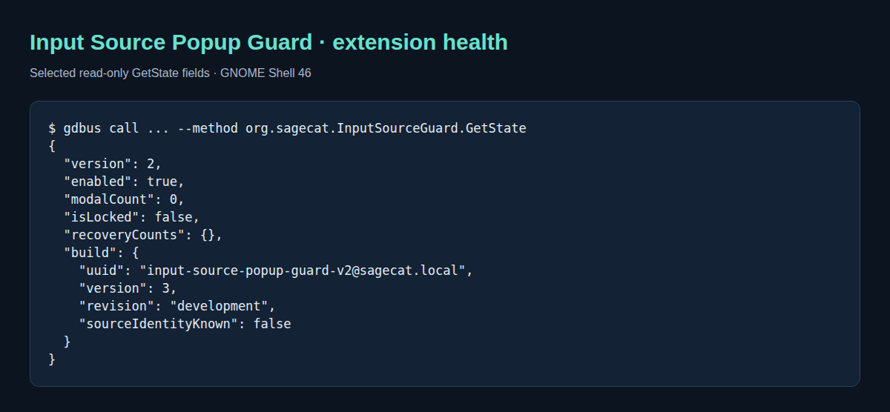

# Input Source Popup Guard v2

GNOME Shell 46 extension that closes stuck keyboard-layout popups, activates a
valid selection once and releases their input grab. Use your usual layout-switching
shortcut. Other switchers and input grabs are unchanged.



Read-only output from a disposable GNOME session. [Capture details](docs/visual-guide.md).

## Install and use

Requires GNOME Shell **46**, Make, and Node.js (20 is tested).
Disable any older input-source guard before enabling this version.

```sh
make check test  # JavaScript syntax and Shell-independent regression tests
make install
gnome-extensions enable input-source-popup-guard-v2@sagecat.local
```

To disable: `gnome-extensions disable input-source-popup-guard-v2@sagecat.local`.

On Wayland, log out and back in if GNOME has not discovered the extension or still
runs an older version. For a workspace-state-managed install, use its next-login deployment.

## Documentation

- [Diagnostics, optional real-popup self-test and screenshots](docs/visual-guide.md)
- [Design diagram](docs/architecture.svg) · [PlantUML source](docs/architecture.puml)
- [Releases](https://github.com/Sage-Cat/input-source-popup-guard/releases)
- [Full desktop lifecycle validation](https://github.com/Sage-Cat/desktop-workspace/blob/main/docs/validation.md) documents integration tests and their limits, not VM coverage of every popup recovery path.
